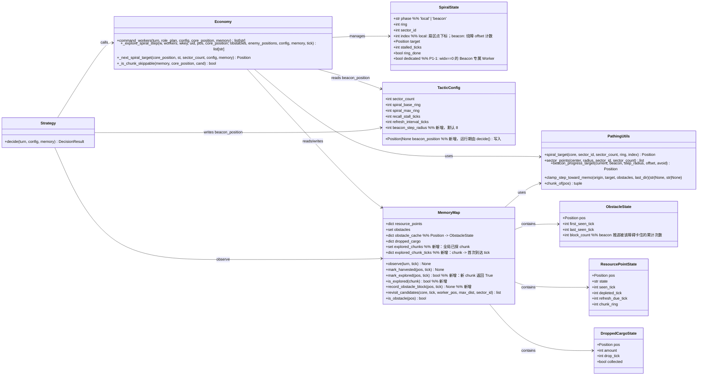

# Arena Hero 战术 Agent「探索优化」— 系统设计 + 任务分解

- 版本：v1.0
- 产出：软件架构师（software-architect / 高见远）
- 日期：2026-08-07
- 输入：`deliverables/PRD-探索优化-2026-08-07.md`（P0-1 / P0-2 / P1-1 / P1-2 / P2-1 / P2-2）
- 范围：仅设计 + 任务分解，**不改代码**
- 设计约束：无新增第三方依赖；不破坏 `decide() → assign_roles() → command_workers()` 调用链可测试性；Beacon 位置经 `config.beacon_position` 传递（decide 每 tick 写入，economy 消费）；保留 `_spiral_state`/`SpiralState` 框架最小侵入；已探 chunk 记忆放 `MemoryMap`（进程内单局），economy 读取。

---

## Part A：系统设计

### 1. 实现方案与框架选型

#### 1.1 核心难点分析

| 难点 | 现状根因（代码实证） | 本设计对策 |
|---|---|---|
| 探索无 Beacon 导向 | `_explore_spiral_step`（economy.py 573-722）只有 local 螺旋扫掠，软回撤一律 ring-1 向 Core 收缩；`command_workers` 已提取 `beacon_ground_pos/carrier_id`（347-363 行）但未进入探索逻辑 | **两阶段探索状态机**：`SpiralState.phase ∈ {'local','beacon'}`（字段已存在，语义未用）。软回撤触发且 `config.beacon_position` 有值时切 `phase='beacon'`，用 `beacon_progress_target` 生成朝 Beacon 的阶段性目标 |
| 重复探索同一区域 | 无跨 tick 已探区域记忆；ring 回绕 `spiral_max_ring→base_ring` 后重复扫同一批点 | **chunk 级已探记忆**放 `MemoryMap.explored_chunks`（全局共享），目标生成时跳过已探 chunk 内的点，`new_chunk` 日志 |
| 多 Worker 无分工 | 所有 Worker 走同一套 local 螺旋（仅扇区分散） | **dedicated Beacon Worker**：`widx==0` 的 Worker 进入 `phase='beacon'` 且不主动回 local，其余保持 local 巡逻 |
| 软回撤退回 Core 导致推进退化 | 软回撤默认 ring-1 收缩 | **软回撤优先切 Beacon**（P1-2 与 P0-1 同一分支）：stall 触发且 Beacon 存在 → 生成 Beacon 方向目标，日志 `recall_soft:beacon` |
| 推进路径反复卡同一障碍 | 障碍仅 `set[Position]`，无 tick 记录，无绕障候选 | **ObstacleCache**（`MemoryMap.obstacle_cache`，含 `first_seen/last_seen/block_count`）；beacon 阶段卡 stall → 记录障碍 + `st.index` 换横向 offset 绕行 |
| **安全网陷阱** | `dist_core > spiral_max_ring + 8` 直接朝 Core 一步（economy.py 616-631）。若 beacon 在 d≈200，dedicated 推进到 d>40 会被强制拽回 Core | **绝对安全网仅 local 阶段生效**；beacon 阶段不设 Core 距离安全网（Beacon 方向即推进方向） |

#### 1.2 框架与库选型

- **不引入任何新第三方依赖**（PRD 明确；requirements.txt 现有 `arena-hero>=0.2.9` / `python-dotenv` / `pytest` 即可满足）。
- 沿用现有架构：**无框架纯函数式决策管线** `decide() → assign_roles() → command_workers()`，与 I/O 解耦（`main.py` 负责 `turn.submit()`）。
- 模式选型：**依赖注入优于模块级单例**。Beacon 位置经 `config.beacon_position` 传递（PRD 约定），chunk 记忆经 `MemoryMap` 实例传递（`command_workers(memory=...)` 已支持，测试注入干净实例）。
- 状态管理约定：每个 Worker 的探索状态仍用模块级 `_spiral_state: dict[str, SpiralState]`（与现状一致），仅扩展字段，不做结构性重构。

#### 1.3 关键设计决策

**决策 1：两阶段探索状态机（P0-1 / P1-1 / P1-2）**

```
local ──(P0-1: soft_recall 触发 ∧ phase=='local' ∧ beacon_position≠None)──▶ beacon
beacon ──(P2-1: beacon_position==None，即消失/被拾取)──▶ local
beacon ──(非 dedicated 且 manhattan(pos, beacon) ≤ beacon_step_radius，到达近旁)──▶ local
dedicated Worker：只要 beacon_position≠None 就保持 beacon，绝不主动回 local
```

- `phase` 字段已存在（economy.py 105），本次真正启用其语义。
- 软回撤分支（economy.py 670-692）改造：先判 Beacon → 有则 `st.phase='beacon'` + `st.target = beacon_progress_target(...)` + 日志 `:recall_soft:beacon`；无则维持原 ring-1 收缩逻辑。
- beacon 阶段目标**每 tick 从当前 pos 重新生成**（无状态函数，见决策 3），`st.index` 复用为绕障 offset 计数器。

**决策 2：Beacon 位置实时追踪（P2-1）**

- `TacticConfig` 是 `@dataclass(frozen=True)`，运行期写入用 `object.__setattr__` 封装为 `set_beacon_position(config, pos)`（仅允许 `decide()` 调用）。
- `decide()` 每 tick：
  - `turn.beacon` 存在且 `status`（规范化 `getattr(status,"value",status)`）== `"GROUND"` → `set_beacon_position(config, beacon.position)`；
  - `CARRIED`（被己方/敌方拾取）或 `turn.beacon` 缺失 → `set_beacon_position(config, None)`，Worker 自动停止向旧位置推进（满足验收 b）。
- 注意：`command_workers` 内已有的 Beacon 拾取/持有者逻辑（347-363 行）**保持不变**，与探索通道互不干扰：拾取靠 `beacon_ground_pos`，探索导向靠 `config.beacon_position`。

**决策 3：Beacon 目标生成（新增 `pathing.beacon_progress_target`）**

```python
def beacon_progress_target(current, beacon, step_radius=8, offset=0, avoid=None) -> Position:
    # 在 current→beacon 方向线上取「距 current 约 step_radius 曼哈顿距离」的点；
    # manhattan(current, beacon) <= step_radius → 直接返回 beacon（收官）；
    # offset 决定横向偏移档位（-1/0/+1，绕障/多 Worker 错开路径）；
    # avoid 为已知障碍集合：直线点在障碍内则横向偏一档重试。
```

- 纯函数、确定性、不依赖 SpiralState，单测可直测。
- 每 tick 重新生成 → 天然随 Worker 推进而推进；`d_beacon = manhattan(pos, beacon)` 单调下降可作进度日志。
- `step_radius` 由新配置项 `beacon_step_radius`（默认 8）控制。

**决策 4：Chunk 级已探记忆（P0-2）**

- `MemoryMap` 新增：
  - `explored_chunks: set[tuple[int,int]]`（全局共享，多 Worker 共同贡献）
  - `explored_chunk_ticks: dict[tuple[int,int], int]`（记录首次到达 tick，供日志/未来过期策略）
  - `mark_explored(pos, tick) -> bool`（新 chunk 返回 True → 日志 `new_chunk`）
  - `is_explored(chunk) -> bool`
- `_explore_spiral_step` 目标生成统一走新 helper `_next_spiral_target(...)`（替换现有 3 处 `spiral_target` 直调：初始目标 / 到达推进 / 软回撤），规则：
  - 候选点所在 chunk ∈ `explored_chunks` **且** ≠ Core 所在 chunk → `st.index += 1` 跳过（环扫完则 ring+1，沿用现有推进语义）；
  - **Core chunk 永不跳过**（枢纽允许重复扫掠）。
- ⚠️ **对 PRD 字面语义的必要修正**：chunk=32×32（pathing.py 14 行），Core 在 (10,10) 时 d≤20 的本地扫掠几乎全部落在 chunk (0,0)。若字面「跳过已探 chunk 内所有点」，首次到达 Core 即标记 (0,0) 已探 → 本地扫掠被整体吞掉。故约定「核心 chunk 例外」。见待明确事项 #1。
- 语义：`explored` = 该 Worker **到达过**该 chunk（`mark_explored(pos)` 每 tick 调用，set 查重开销可忽略）。

**决策 5：多 Worker 分工（P1-1）**

- `SpiralState` 新增 `dedicated: bool = False`。
- 指派规则：`_explore_spiral_step` 中 `widx = _worker_index(uid, workers, fallback)`；`widx == 0` 且 `config.beacon_position is not None` → `dedicated=True`、`phase='beacon'`。
- 持久化在 `SpiralState`：Worker 列表变动（死亡/补员）后新 `widx==0` 的 Worker 自动接任；原 dedicated 即使 widx 变化也保持。
- dedicated Worker 探索时**强制 beacon**（不 back to local）；Beacon 消失后自动回 local。
- 拾取/采集优先级不变：`command_workers` 中「站在资源格 harvest」「站在 beacon GROUND pickup」「cargo 回收」先于探索，因此 dedicated Worker 沿途仍会正常采集，只是探索目标恒为 Beacon。
- 日志追加 `:dedicated_beacon` 标记（验收 a）。

**决策 6：Beacon 路径障碍规避记录（P2-2）**

- `MemoryMap` 新增 `ObstacleState{pos, first_seen_tick, last_seen_tick, block_count}` 与 `obstacle_cache: dict[Position, ObstacleState]`；`observe()` 对每个可见障碍更新时间戳（不破坏现有 `obstacles: set` API）；`record_obstacle_block(pos, tick)` 累计 `block_count`。
- beacon 阶段卡 stall（`direction is None` 或无进展）：扫描四邻，把位于 `obstacles` 的邻格 `record_obstacle_block`，日志 `worker:{uid}:beacon_obstacle:pos=...:count=...`（验收 a）。
- 「不因同一障碍反复卡 stall」（验收 b）：beacon 阶段 stall ≥ `recall_stall_ticks` → `st.index += 1` 换横向 offset，`beacon_progress_target(..., offset=st.index % 3 - 1, avoid=obstacles)` 生成绕行目标，不回 Core。

#### 1.4 改动面总览（最小侵入确认）

- 新增公共 API：`config.set_beacon_position`、`pathing.beacon_progress_target`、`memory.mark_explored/is_explored/record_obstacle_block`、`economy._next_spiral_target`（私有）。
- 修改私有函数：`_explore_spiral_step` 增 `memory`/`tick` 参数（由 `command_workers` 传入，默认 None/0，旧调用兼容）。
- 不修改：`decide()` 签名、`command_workers()` 签名、`assign_roles()`、`SpiralState` 既有字段、`pathing.clamp_step_toward_memo` 等。

### 2. 文件列表（相对路径）

| 文件 | 状态 | 说明 |
|---|---|---|
| `bot/config.py` | 修改 | `TacticConfig` +`beacon_position: Optional[Position]=None`、`beacon_step_radius: int=8`；模块函数 `set_beacon_position(config, pos)`（frozen 用 `object.__setattr__`）；`from bot.pathing import Position`（无循环依赖） |
| `bot/pathing.py` | 修改 | +`beacon_progress_target(current, beacon, step_radius, offset, avoid)` 纯函数 |
| `bot/memory.py` | 修改 | +`explored_chunks`/`explored_chunk_ticks`/`mark_explored`/`is_explored`；+`ObstacleState`/`obstacle_cache`/`record_obstacle_block`；`observe()` 更新障碍时间戳 |
| `bot/economy.py` | 修改 | `SpiralState` +`dedicated`；`_explore_spiral_step` 增 `memory`/`tick` 参数、beacon 阶段、`_next_spiral_target`/`_is_chunk_skippable`、dedicated 指派、软回撤切 Beacon、beacon 障碍记录、安全网仅 local；`command_workers` 透传 `memory`/`tick` |
| `bot/strategy.py` | 修改 | `decide()` 每 tick 写 `config.beacon_position`（GROUND 写 / CARRIED·消失清 None），状态规范化 `getattr(status,"value",status)` |
| `tests/stubs.py` | 修改（可选） | 现有 `StubBeacon`/`StubTurn.beacon` 已满足；如需可加便捷 helper（如 `set_beacon_ground/carried`） |
| `tests/conftest.py` | 修改 | 清理新增模块态：`WORLD_MEMORY.explored_chunks/explored_chunk_ticks/obstacle_cache`、`DEFAULT_CONFIG.beacon_position` 复位 |
| `tests/test_pathing.py` | 修改 | +`beacon_progress_target` 用例（直线/短距/避障/offset） |
| `tests/test_memory.py` | 修改 | +`explored_chunks`/`mark_explored`/`obstacle_cache`/`record_obstacle_block` 用例 |
| `tests/test_economy.py` | 修改 | +beacon 阶段切换/`phase=beacon` 日志、chunk 跳过/`new_chunk`、dedicated 分工、`recall_soft:beacon`、beacon 障碍记录用例 |
| `tests/test_strategy.py` | 修改 | +`decide()` 写/清 `config.beacon_position` 同步用例（GROUND/CARRIED/消失） |
| `docs/system_design-explore.md` | 新增 | 本文档 |
| `docs/class-diagram-explore.mermaid` | 新增 | 类图 |
| `docs/sequence-diagram-explore.mermaid` | 新增 | 时序图 |

### 3. 数据结构与接口（类图）



### 4. 程序调用流程（时序图）

```mermaid
sequenceDiagram
    autonumber
    participant D as decide (strategy.py)
    participant C as TacticConfig
    participant W as command_workers (economy.py)
    participant M as MemoryMap
    participant E as _explore_spiral_step
    participant P as pathing.py
    participant U as Worker unit

    D->>C: set_beacon_position(config, pos/None)  %% GROUND→写；CARRIED/消失→None
    D->>W: command_workers(turn, role_plan, config, core_position, memory)
    W->>W: 提取 beacon_ground_pos / beacon_carrier_ids（拾取/持有者逻辑不变）

    loop 每个 WORKER（无资源/无 cargo 才进入探索）
        W->>E: _explore_spiral_step(w, workers, wkey, uid, pos, core, obstacles, enemies, config, memory, tick)
        E->>M: mark_explored(pos, tick)  %% 到达新 chunk → 日志 new_chunk
        alt phase == local
            E->>P: _next_spiral_target(...) = spiral_target(core, sector, ring, index)  %% 跳过已探 chunk（Core chunk 除外）
            E->>P: clamp_step_toward_memo(pos, target, obstacles, last_dir)
            alt stalled >= recall_stall_ticks 且 config.beacon_position 有值
                E->>E: st.phase = "beacon"; st.target = beacon_progress_target(...)  %% 日志 recall_soft:beacon
            else stalled >= recall_stall_ticks 且无 Beacon
                E->>E: 维持 local：index+1 / ring-1 收缩（原逻辑）
            end
        else phase == beacon
            alt config.beacon_position 为 None（消失/被拾取）
                E->>E: st.phase = "local"（回退本地扫掠）
            else
                E->>P: beacon_progress_target(pos, beacon, step_radius, offset=st.index%3-1, avoid=obstacles)
                E->>P: clamp_step_toward_memo(pos, target, obstacles, last_dir)
                alt 阻塞（direction None / 无进展）
                    E->>M: record_obstacle_block(nxt, tick)  %% 日志 beacon_obstacle
                    E->>E: st.index += 1（换 offset 绕障，不因同一障碍反复卡）
                end
            end
        end
        E->>U: move(direction) 或 wait()
    end
```

---

## Part B：任务分解

### 5. 任务列表（有序，按实现顺序）

| Task ID | 任务名 | 源文件（创建/修改） | 依赖 | 优先级 |
|---|---|---|---|---|
| T01 | 项目基础设施：配置 + 几何 + 记忆数据模型 | `bot/config.py`、`bot/pathing.py`、`bot/memory.py`、`tests/stubs.py` | 无 | P0 |
| T02 | 记忆/几何单测：chunk 记忆与 Beacon 目标纯函数 | `tests/test_memory.py`、`tests/test_pathing.py`、`tests/conftest.py` | T01 | P0 |
| T03 | 探索状态机：两阶段 local/beacon + 多 Worker 分工 | `bot/economy.py`、`tests/test_economy.py`、`tests/conftest.py` | T01 | P0 |
| T04 | 策略接线：beacon_position 每 tick 同步 | `bot/strategy.py`、`tests/test_strategy.py`、`tests/conftest.py` | T01 | P0 |
| T05 | 集成回归：全量测试 + 验收标记断言 + 修复 | `tests/test_economy.py`、`tests/test_strategy.py`、`run_inline_tests.py`（如有需要） | T02、T03、T04 | P0 |

**T01 项目基础设施（P0，无依赖）**
- `bot/config.py`：`TacticConfig` 增 `beacon_position: Optional[Position] = None`、`beacon_step_radius: int = 8`；`from bot.pathing import Position`（pathing 不依赖 config，无环）；模块函数 `set_beacon_position(config, pos)` 用 `object.__setattr__` 写入 frozen dataclass，docstring 注明「仅 decide() 可写」。
- `bot/pathing.py`：`beacon_progress_target(current, beacon, step_radius=8, offset=0, avoid=None) -> Position`——方向线取步距点；`manhattan ≤ step_radius` 直接返回 beacon；直线点在 `avoid` 内按 offset 横向偏移一档重试。
- `bot/memory.py`：`explored_chunks: set`、`explored_chunk_ticks: dict`、`mark_explored(pos, tick) -> bool`、`is_explored(chunk) -> bool`；`ObstacleState` dataclass + `obstacle_cache: dict` + `record_obstacle_block(pos, tick)`；`observe()` 中障碍累积同时更新 `obstacle_cache` 时间戳（保持 `obstacles` set API 不变）。
- `tests/stubs.py`：确认 `StubBeacon` 字段够用；如需可加 `StubTurn.set_beacon(status, pos, carrier)` 便捷方法（不改既有字段）。
- 验收：`python -c "from bot.config import set_beacon_position, TacticConfig; c=TacticConfig(); set_beacon_position(c,(1,2)); assert c.beacon_position==(1,2)"` 通过；`beacon_progress_target((0,0),(10,0),4)` 返回约 (4,0)；`MemoryMap().mark_explored((1,1),1)` 返回 True、重复返回 False。

**T02 记忆/几何单测（P0，依赖 T01）**
- `tests/test_pathing.py`：`beacon_progress_target` 直线推进/短距收官/avoid 避障/offset 确定性用例。
- `tests/test_memory.py`：`mark_explored/is_explored/explored_chunk_ticks`；`record_obstacle_block` 累计 `block_count`、`observe` 更新 `last_seen_tick`。
- `tests/conftest.py`：`_clean_global_state` 增清理 `WORLD_MEMORY.explored_chunks/explored_chunk_ticks/obstacle_cache`。
- 验收：新增用例全绿，既有用例不回归。

**T03 探索状态机（P0，依赖 T01）**
- `bot/economy.py`：
  - `SpiralState` + `dedicated: bool = False`。
  - `_explore_spiral_step` 签名 +`memory: Optional[MemoryMap] = None, tick: int = 0`（`command_workers` 调用处透传）。
  - 顶部：`if config.beacon_position is not None and widx == 0 and not st.dedicated: st.dedicated=True; st.phase='beacon'`；dedicated 且 beacon 存在时强制 `phase='beacon'`。
  - `_next_spiral_target(core_position, st, sector_count, config, memory)`：替换现有 3 处 `spiral_target` 直调，跳过 `_is_chunk_skippable` 为 True 的点（已探 chunk 且非 Core chunk；跳过逻辑沿用 index+1 / ring+1 / 回绕语义）。
  - `_is_chunk_skippable(memory, core_position, cand)`：`memory is None → False`；`chunk_of(cand)==chunk_of(core) → False`；否则 `memory.is_explored(chunk_of(cand))`。
  - 到达标记：`if memory and memory.mark_explored(pos, tick): logs.append(new_chunk=...)`。
  - 软回撤分支（现有 670-692）：先判 `st.phase=='local' and config.beacon_position is not None` → 切 beacon + `beacon_progress_target` + 日志 `:recall_soft:beacon`；否则原逻辑。
  - beacon 阶段分支：beacon 为 None → 回 local；否则每 tick 重算 `beacon_progress_target(pos, beacon, step_radius, offset=st.index%3-1, avoid=obstacles)` → `clamp_step_toward_memo`；stall 时扫描四邻障碍 `record_obstacle_block` + 日志 `beacon_obstacle`；stall ≥ 阈值 → `st.index += 1` 换 offset（不回 Core）。
  - 绝对安全网（616-631）加 `st.phase == 'local'` 守卫（beacon 阶段不设 Core 距离安全网）。
  - 日志扩展：beacon 阶段追加 `:phase=beacon:d_beacon={d}`、`:dedicated_beacon`；到达新 chunk 追加 `:new_chunk=({cx},{cy})`。
- `tests/test_economy.py`：用例见验收。
- `tests/conftest.py`：无新增（T02 已清理记忆态）。
- 验收（对 PRD）：(a) soft_recall 后日志含 `phase=beacon`；(b) 日志含 `new_chunk`；(c) 日志含 `dedicated_beacon`；(d) 日志含 `recall_soft:beacon`；(e) 同一已探 chunk 的扇区目标被跳过；(f) beacon 障碍卡 stall 后换 offset 不再同点反复。

**T04 策略接线（P0，依赖 T01）**
- `bot/strategy.py`：`decide()` 的 Beacon 提取段（现 104-107 仅日志）改为：
  ```python
  beacon = getattr(turn, "beacon", None)
  if beacon is not None:
      status = getattr(getattr(beacon, "status", None), "value", getattr(beacon, "status", None))
      if status == "GROUND":
          set_beacon_position(config, _as_position(beacon.position))
          result.logs.append(f"strategy:beacon:pos={_as_position(beacon.position)}")
      else:  # CARRIED 等
          set_beacon_position(config, None)
          result.logs.append(f"strategy:beacon:cleared:carrier={getattr(beacon,'carrier_id',None)}")
  else:
      set_beacon_position(config, None)
      result.logs.append("strategy:beacon:absent")
  ```
- `tests/test_strategy.py`：GROUND → 写入；CARRIED → 清 None；turn 无 beacon → 清 None；多 tick 连续同步。
- `tests/conftest.py`：`_clean_global_state` 增 `object.__setattr__(DEFAULT_CONFIG, "beacon_position", None)`（防 default-config 跨测试污染）。
- 验收（P2-1）：每 tick `config.beacon_position` 与 `turn.beacon` 同步；被拾取后清空，beacon 阶段 Worker 停止向旧位推进。

**T05 集成回归（P0，依赖 T02/T03/T04）**
- 全量跑 `pytest tests/` 与 `python run_inline_tests.py`（现有入口），修复跨模块回归。
- 端到端场景：2 Worker + StubBeacon(GROUND, 远点) → 断言 1 个 `dedicated_beacon` + 1 个 local；软回撤触发切 beacon 后 `d_beacon` 单调下降；beacon 消失后全回 local。
- 验收：全绿 + PRD 六项验收标记（`phase=beacon`/`new_chunk`/`dedicated_beacon`/`recall_soft:beacon`/`beacon_obstacle`）均有对应断言。

### 6. 依赖包列表（应无新增）

```
- arena-hero>=0.2.9,<0.3    # 运行时 SDK（已安装；beacon/turn.events 纯读 API）
- python-dotenv>=1.0.0      # .env 加载（已有）
- pytest>=8.0.0             # 测试（已有）
```

无新增第三方依赖；全部改动基于标准库 `dataclasses/typing` 与现有模块。

### 7. 共享知识（跨文件约定）

- **phase 状态机**：`local`（基于 Core 螺旋扫掠）与 `beacon`（朝 Beacon 推进）两阶段；转换条件见决策 1。`dedicated` Worker 在 beacon 存在时恒为 beacon；`config.beacon_position` 为 None 时任何 beacon 阶段立即回 local。
- **beacon_position 语义**：`TacticConfig` 为 frozen dataclass，运行期经 `config.set_beacon_position(config, pos)`（`object.__setattr__`）写入；**仅 `decide()` 可写**，economy 只读；`"GROUND"` → 写位置；`"CARRIED"`/缺失 → 清 None。SDK `status` 可能是枚举，统一 `getattr(status, "value", status)` 规范化。
- **beacon 目标生成规则**：`beacon_progress_target` 每 tick 从 Worker 当前 pos 朝 beacon 取 `beacon_step_radius` 步距点；`offset=st.index%3-1` 提供 -1/0/+1 横向偏移用于绕障与多 Worker 错开路径；直线点在已知障碍内则横向偏一档。
- **chunk 记忆语义**：`explored_chunks` 全局共享（MemoryMap 单例/注入实例），`mark_explored` 在 Worker 到达时调用；目标生成跳过「已探 chunk 且非 Core chunk」的点；**Core chunk 永不跳过**；整局永久记录（待明确 #3 确认是否过期）。
- **日志标记约定（测试断言依据）**：`phase=beacon`、`dedicated_beacon`、`new_chunk=({cx},{cy})`、`recall_soft:beacon`、`beacon_obstacle:pos=...:count=...`、`d_beacon=`。现有 `explore/ring/sec/stall/d` 字段保留。
- **测试约定**：`conftest._clean_global_state` 负责清理 `_spiral_state`/`_last_move_dir`/`WORLD_MEMORY.*`（含新增 `explored_chunks`/`explored_chunk_ticks`/`obstacle_cache`）与 `DEFAULT_CONFIG.beacon_position`；测试一律注入独立 `TacticConfig`，避免 frozen 单例被污染。
- **安全网例外**：绝对安全网（`dist_core > spiral_max_ring + 8 → 朝 Core`）仅 local 阶段生效；beacon 阶段以 Beacon 方向为准，不受 Core 距离限制。
- **拾取与探索互不干扰**：`command_workers` 现有 `beacon_ground_pos` 拾取/持有者逻辑（347-363 行）不变；`config.beacon_position` 仅驱动探索目标。

### 8. 待明确事项（≤3）

1. **chunk 粒度与「已探」语义**：chunk=32×32，Core 在 (10,10) 时 d≤20 本地扫掠几乎全在 chunk (0,0) 内；字面「跳过已探 chunk 内所有点」会吞掉本地扫掠。本设计以「Core chunk 永不跳过」修正；若产品期望更细粒度（如 8×8 sub-chunk 或按 (ring, sector, chunk) 组合记忆），需确认。
2. **Beacon 被敌方拾取后的行为**（PRD Open Question 1）：本设计保守处理——`CARRIED` 一律清 `beacon_position` 停止推进，不追击敌方 carrier；若需追击，依赖敌方 carrier 位置可见性，需另行确认。
3. **已探 chunk 有效期**（PRD Open Question 2）：本设计整局永久记录；若地图存在动态变化/回填机制，需确认是否引入过期（当前 `explored_chunk_ticks` 已为未来过期策略预留数据）。
