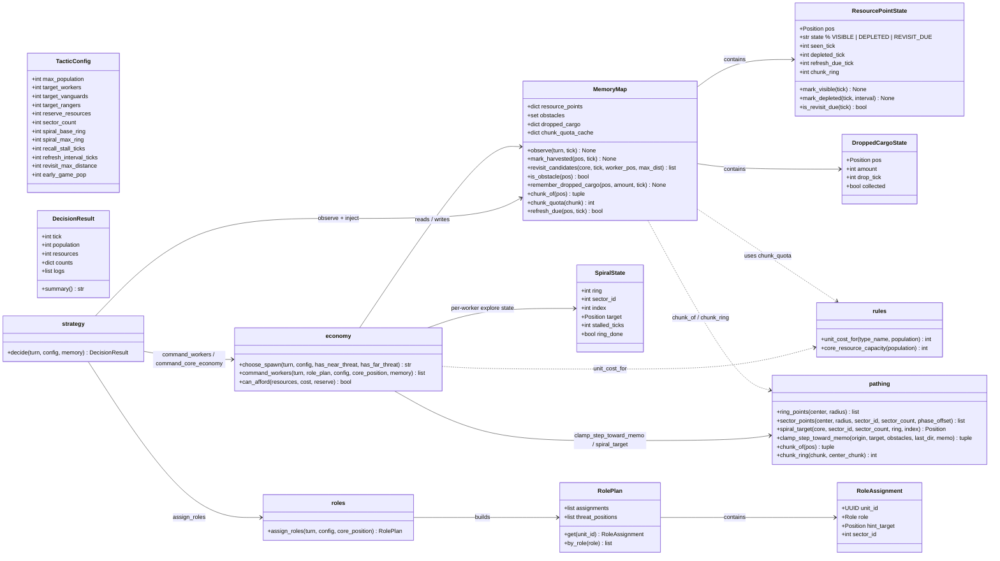
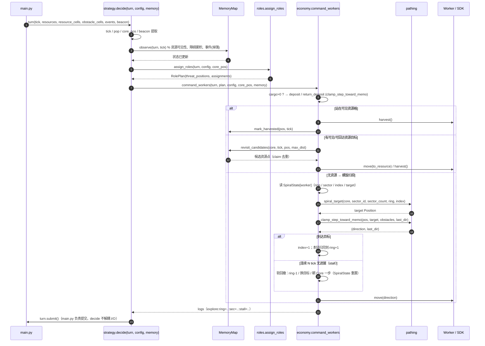
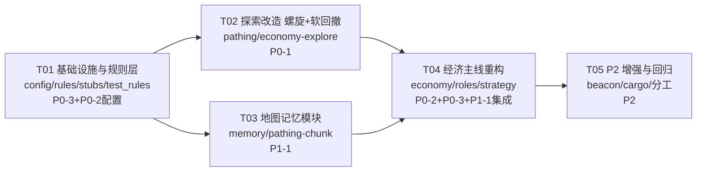

# Arena Hero 战术 Agent「优化完善」— 系统设计 + 任务分解

- 版本：v1.0
- 产出：软件架构师（software-architect / 高见远）
- 日期：2026-08-07
- 输入：`deliverables/PRD-增量优化-2026-08-07.md`（v1.0）
- 范围：仅设计 + 任务分解，**不改代码**

---

## Part A：系统设计

### 1. 实现方案与框架选型

#### 1.1 核心难点分析

| 难点 | 现状根因（代码实证） | 本设计对策 |
|---|---|---|
| d=36/37 势阱横跳 | `economy.py` `recall_dist = explore_max_radius+4 = 36` 硬边界 + 探索「绝不朝 Core 收缩」守卫（line 595-605）形成单维势阱 | 改为**目标点导航 + 软回撤**：探索不再「每 tick 外扩一步」，而是导航到具体螺旋目标点；`recall_dist` 硬边界删除，改用「连续 N tick 无进展才回撤」 |
| 无记忆、重复扫死路 | `resource_cells/obstacle_cells` 每 tick 仅含可见格（SDK `TerrainView` 批次），无跨 tick 状态 | 新增**进程内地图记忆** `MemoryMap`：累积资源点/障碍，按 `depleted_tick + refresh_interval(4)` 安排回访 |
| 探索低效（主轴外扩撞边界） | 8 向 `EXPLORE_DIRS` + 相位振荡 | 改为**曼哈顿环螺旋扫掠**：按 Worker 索引分扇区（sector），逐环（ring）覆盖，目标为具体 Position |
| 过时维护费 | `config.py` 仍含 upkeep 字段 + `population_upkeep`；`choose_spawn` 用 `upkeep>0` 阻断（line 257/274） | 全部删除（T04 经济主线）；config 字段清理（T01）；SDK 0.2.9 已无 `upkeep_next_tick` 字段 |
| 固定单位价格 | `config.worker_cost=5` 等写死，pop≥20 涨价不可见 | 统一走 `bot/rules.py: unit_cost_for(type_name, population)`，包装 SDK `arena_hero.rules.unit_cost()`，spawn 按 `pop+1` 估算 |

#### 1.2 框架与库选型

- **不引入任何新第三方依赖**（PRD 明确要求）。
- 沿用现有架构：**无框架的纯函数式决策管线** `decide() → assign_roles() → command_*()`，与 I/O 解耦（`main.py` 负责 `turn.submit()`）。
- 唯一新增 SDK 依赖面：`arena_hero.rules.unit_cost / core_resource_capacity`、`turn.beacon`、`turn.events`（`WORKER_CARGO_DROPPED`）——SDK 0.2.9 已安装，且这些 API 是纯读、无副作用，不破坏可测试性。
- 模式选型：**依赖注入优于模块级单例**。现有代码大量使用模块级记忆 dict（`_last_explore_pos` 等）导致测试需手动 clear；本设计用 `MemoryMap` 类 + 可选参数注入（`decide(turn, config, memory=None)` 默认用模块级 `WORLD_MEMORY`），既保持线上零改动成本，又让单测可传干净实例。
- 状态管理约定：**每个 Worker 的探索状态 `SpiralState` 仍用进程内 dict（按 worker id 字符串键）**，与现有 `_explore_axis` 风格一致，但收敛为单一 `_spiral_state: dict[str, SpiralState]`，便于测试清理。

#### 1.3 关键设计决策

**决策 1：软回撤替代硬边界（P0-1）**
- 删除 `recall_dist = explore_max_radius + 4` 硬阈值。
- 探索态 `SpiralState` 记录 `stalled_ticks`：若连续 `config.recall_stall_ticks`（默认 6）tick 对目标点无曼哈顿进展（或位置未变），执行**软回撤**：优先推进环内下一目标点；若当前环已到 sector 尽头则 ring-1；若 `d > spiral_max_ring + 8`（绝对安全网，极少触发）则直接朝 Core 走一步。回撤步写入方向记忆，杜绝反向对抖。
- 删除「绝不朝 Core 收缩」对切向扫掠的硬禁止：目标点导航允许沿环切向移动（曼哈顿距离可暂时持平/微降），不再制造单维势阱。

**决策 2：地图记忆模块 `bot/memory.py`（P1-1）**
- 单局进程内状态，`MemoryMap` 类；模块级 `WORLD_MEMORY` 单例供线上 `decide()` 默认使用；测试注入新实例。
- 状态机（资源点）：`VISIBLE →（从 resource_cells 消失）→ DEPLETED →（tick ≥ depleted_tick + refresh_interval_ticks）→ REVISIT_DUE →（再次可见）→ VISIBLE`。
  - 判定依据：SDK 每 tick 的 `resource_cells` 只含**当前可见** RESOURCE 格；某格从可见集合消失且记忆为 VISIBLE → 判定已消耗（`depleted_tick = tick`）。这与 PRD 待确认#1 的「已消耗未刷新 vs 未见」一致：未见=不在记忆；已消耗=在记忆且当前不可见。
  - 回补节拍：`refresh_interval_ticks = 4`（近似「每 4 resolved tick」，SDK 无 resolved_tick 字段，用 `turn.tick` 近似——见待明确#1）。
  - 刷新配额：`chunk_quota(chunk) = max(2, (16*8)//(8 + ring))`，ring 为 chunk 相对 Core chunk 的曼哈顿环序号（假设，见待明确#1）；`chunk_of(pos) = (x//32, y//32)`（chunk 32×32）。配额用于回访调度时**每 chunk 每批最多派 N 个 Worker** 的软约束（防扎堆），不精确模拟服务端。
- 障碍集合：`obstacles: set[Position]`，永久累积（地形），供 `clamp_step_toward_memo` 绕障。
- 掉落 cargo（P2-2）：`turn.events` 中 `WORKER_CARGO_DROPPED`（含 `position`、`values.amount`）→ 记录 `dropped_cargo: dict[Position, DroppedCargoState]`；空载 Worker 可优先前往回收（若该格同时出现在 `resource_cells` 则走普通 harvest 路径）。

**决策 3：螺旋扫掠（P1-2）**
- 几何：曼哈顿菱形环 `ring_points(center, radius)`（顺时针排序，复用 `_angle_key`）；`sector_points(...)` 按 `index % sector_count == sector_id` 取扇区子集（`sector_count` 默认 4，等于 Worker 分散度，天然防重叠）。
- 探索态推进：`SpiralState {ring, sector_id, index, target, stalled_ticks, ring_done}`；`spiral_target(core, sector_id, sector_count, ring, index)` 返回具体 Position；`clamp_step_toward_memo` 导航。到达目标 → index+1；index 超出扇区点列表 → ring+1；ring 超过 `spiral_max_ring` → 软回撤回 base ring 重新开始。
- Worker 索引 → 扇区：`sector_id = _worker_index(uid, workers, fallback) % sector_count`（复用现有 `_worker_index`）。

**决策 4：动态价格（P0-3）**
- `bot/rules.py: unit_cost_for(type_name, population)` 延迟导入 SDK `arena_hero.rules.unit_cost(UnitType[name], population)`；导入失败时回退到本地同公式（复制 SDK 实现，含 round-half-up），保证纯逻辑可单测。
- `choose_spawn` 中成本用 **spawn 后人口** `pop + 1`（PRD 约定；服务器口径见待明确#2）。`reserve_resources / early_game_pop` 逻辑保留。

**决策 5：去维护费（P0-2）**
- T01 仅移除 `TacticConfig` 的 `upkeep_soft_cap/hard_cap` 字段，**保留**模块级 `population_upkeep()`（标记 deprecated，注释「v0.14 已无维护费，待 T04 移除」），避免 T01 直接破坏 `economy.py` 的 import。
- T04 删除 `_get_upkeep_next`、`choose_spawn` 中 upkeep 阻断与预测、`economy.py` 对 `population_upkeep` 的 import，并同步重写相关单测。

**决策 6：P2 增强（可评估）**
- P2-1 Beacon：`turn.beacon`（`ChampionBeacon.position/status/carrier_id`）判断持有者；若持有者为己方 Worker，分配资源目标时**优先**（1 点→2 资源）。拾取：beacon GROUND 且与 Worker 同格 → `w.pickup_beacon()`。
- P2-2 cargo 回收：见决策 2。
- P2-3 多 Worker 分工：资源目标分配按 `worker_sector` 优先本扇区点（`revisit_candidates` 支持 sector 过滤），探索天然分扇区。
- P2-4 Core 迁移：仅评估，不改行为（信息不足，见待明确#3）。

### 2. 文件列表（相对路径）

| 文件 | 状态 | 说明 |
|---|---|---|
| `bot/config.py` | 修改 | 删 upkeep 字段；调 max_population；新增探索/记忆参数 |
| `bot/rules.py` | 新增 | 动态单位价格 / Core 容量 / chunk 配额（SDK 包装 + 本地回退） |
| `bot/memory.py` | 新增 | `MemoryMap` / `ResourcePointState` / `DroppedCargoState` / `WORLD_MEMORY` |
| `bot/pathing.py` | 修改 | +`ring_points` / `sector_points` / `spiral_target` / `chunk_of` / `chunk_ring` |
| `bot/economy.py` | 修改 | 删 upkeep；动态价格；`command_workers` 接 memory + 螺旋扫掠 + 软回撤；P2 增强 |
| `bot/roles.py` | 修改 | `RoleAssignment` +`sector_id`；可选 hint 细化 |
| `bot/strategy.py` | 修改 | `decide` +`memory` 参数、`memory.observe`、beacon 提取 |
| `tests/stubs.py` | 修改 | `StubState` 去 upkeep 声明；`StubTurn` +`events/beacon` |
| `tests/test_rules.py` | 新增 | 动态价格 0-19/20/25、容量、chunk 配额用例 |
| `tests/test_memory.py` | 新增 | 状态机、回访、障碍累积、cargo 事件用例 |
| `tests/test_pathing.py` | 修改 | +螺旋/扇区/chunk 用例 |
| `tests/test_economy.py` | 修改 | 重写 upkeep 相关；+软回撤/螺旋/记忆回访用例 |
| `tests/test_strategy.py` | 修改 | +memory 注入回归 |
| `docs/system_design.md` | 新增 | 本文档 |
| `docs/class-diagram.mermaid` | 新增 | 类图 |
| `docs/sequence-diagram.mermaid` | 新增 | 时序图 |

### 3. 数据结构与接口（类图）



#### 关键接口签名（供工程师直接实现）

```python
# bot/rules.py（新增）
def unit_cost_for(type_name: str, population: int) -> int: ...
def core_resource_capacity(population: int) -> int: ...
def chunk_quota(ring: int) -> int:  # max(2, (16*8)//(8+ring))

# bot/pathing.py（新增函数）
CHUNK_SIZE: int = 32
def chunk_of(pos: Position) -> tuple[int, int]: ...
def chunk_ring(chunk: tuple[int, int], center_chunk: tuple[int, int]) -> int: ...
def ring_points(center: Position, radius: int) -> list[Position]: ...        # 顺时针
def sector_points(center: Position, radius: int, sector_id: int,
                  sector_count: int = 4, phase_offset: int = 0) -> list[Position]: ...
def spiral_target(core: Position, sector_id: int, sector_count: int,
                  ring: int, index: int) -> Position: ...

# bot/memory.py（新增）
class ResourcePointState: ...   # 见类图
class DroppedCargoState: ...    # 见类图
class MemoryMap:
    def observe(self, turn: Any, tick: int) -> None: ...
    def mark_harvested(self, pos: Position, tick: int) -> None: ...
    def revisit_candidates(self, core: Position, tick: int, worker_pos: Position,
                           max_dist: int, sector_id: Optional[int] = None) -> list[Position]: ...
    def is_obstacle(self, pos: Position) -> bool: ...
    def remember_dropped_cargo(self, pos: Position, amount: int, tick: int) -> None: ...
WORLD_MEMORY: MemoryMap = MemoryMap()

# bot/economy.py（修改）
def choose_spawn(turn, config=DEFAULT_CONFIG, has_near_threat=False,
                 has_far_threat=False) -> Optional[str]: ...
def command_workers(turn, role_plan, config=DEFAULT_CONFIG,
                    core_position: Optional[Position] = None,
                    memory: Optional[MemoryMap] = None) -> list[str]: ...

# bot/strategy.py（修改）
def decide(turn, config=DEFAULT_CONFIG,
           memory: Optional[MemoryMap] = None) -> DecisionResult: ...
```

### 4. 程序调用流程（时序图）



CRUD 覆盖说明：`observe` 负责记忆的 Create/Update（资源/障碍/掉落）；`mark_harvested` 负责状态迁移（Update）；`revisit_candidates` 负责 Read（查询）；记忆的 Delete 仅 `DroppedCargoState.collected=True`（软删除）；`MemoryMap` 生命周期 = 单局进程（不持久化）。

### 5. 待明确事项（≤3）

1. **「ring」与「4 resolved tick」的精确语义**：`quota = max(2, floor(16*8/(8+ring)))` 中 ring 是指 Core 所在 chunk 的曼哈顿环序号，还是地图中心/其它定义？SDK `PlayerState` 无 `resolved_tick` 字段，拟用 `turn.tick` 近似 4 tick 回补节拍。→ 影响 `chunk_quota` 与回访调度精度（当前按假设实现，真机日志可校验）。
2. **`unit_cost` 的人口参数口径**：服务器按「当前人口」还是「spawn 后人口（pop+1）」计费？PRD 建议 pop+1；本设计按 pop+1 实现，需在 pop=19→20、24→25 边界用真机验证。
3. **掉落 cargo 的可见性**：`WORKER_CARGO_DROPPED` 是否同时出现在 `resource_cells`（RESOURCE terrain）？若否，P2-2 依赖 `events.position/amount` 建模，且回收需在事件格附近盲搜；Beacon carrier 判定用 `turn.beacon.carrier_id` 是否已含敌方携带者（影响我方可否拾取）。

---

## Part B：任务分解

### 6. 所需依赖包

**无新增依赖**（沿用现有）：

```
- arena-hero>=0.2.9,<0.3  # 官方 SDK（rules.unit_cost / turn.beacon / events / terrain）
- python-dotenv>=1.0.0     # .env 加载
- pytest>=8.0.0            # 测试（dev）
```

### 7. 任务列表（按依赖顺序，≤5）

#### T01 基础设施与规则层（P0-3 基础 + P0-2 配置清理）

- **Source Files**：`bot/config.py`、`bot/rules.py`（新增）、`tests/stubs.py`、`tests/test_rules.py`（新增）
- **Dependencies**：无
- **Priority**：P0
- **内容**：
  - `config.py`：删除 `upkeep_soft_cap/hard_cap` 字段；`population_upkeep()` 保留但标注 `deprecated`（避免破坏 economy import，T04 再删）；`max_population` 上调至 30（建议值，见待明确#2）、`target_workers` 14；新增 `sector_count=4`、`spiral_base_ring=5`、`spiral_max_ring=32`、`recall_stall_ticks=6`、`refresh_interval_ticks=4`、`revisit_max_distance=40`；移除 `worker_cost/vanguard_cost/ranger_cost`（价格改走 rules）。
  - `rules.py`（新）：`unit_cost_for`（SDK 包装 + 本地回退，含 round-half-up）、`core_resource_capacity`、`chunk_quota`。
  - `stubs.py`：`StubState` 移除 `upkeep_next_tick` 声明（`setattr` 兼容旧测试）；`StubTurn` 增加 `events: list = []`、`beacon: Optional[StubBeacon] = None`；新增 `StubBeacon`（position/status/carrier_id）。
  - `test_rules.py`（新）：`unit_cost_for` 覆盖 pop 0-19（基础价 5/10/12）、pop 20/25（`round_half_up(base×(13/10)^k)` 涨价档：Worker 20→7、25→9 等）、`chunk_quota` 边界（ring 0→16、ring 8→8、ring 56→2）。

#### T02 探索改造：螺旋扫掠 + 目标点导航 + 软回撤（P0-1）

- **Source Files**：`bot/pathing.py`、`bot/economy.py`（explore 分支）、`tests/test_pathing.py`、`tests/test_economy.py`（探索相关）
- **Dependencies**：T01
- **Priority**：P0
- **内容**：
  - `pathing.py`：新增 `ring_points`（曼哈顿环顺时针，复用 `_angle_key`）、`sector_points`（`index % sector_count == sector_id`）、`spiral_target`。
  - `economy.py`：**重写** `command_workers` 无资源分支——删除 `recall_dist` 硬边界与「绝不朝 Core 收缩」守卫；引入 `_spiral_state: dict[str, SpiralState]`（dataclass 放 economy 或 pathing）；目标点导航用 `clamp_step_toward_memo`；到达目标推进 index/ring；连续 `recall_stall_ticks` 无进展 → 软回撤（换目标 / ring-1 / 朝 Core 一步）；保留 `_pick_explore_direction_avoiding_enemies` 但改为「避敌改道」而非「强制外扩」。日志新增 `:ring=..:sec=..:stall=..` 字段。
  - `test_pathing.py`：扇区不重叠、环点数量/顺序、spiral_target 确定性。
  - `test_economy.py`：更新 `test_worker_recall_boundary_no_oscillation` / `test_worker_explore_respects_max_radius`——d=36/37 场景 10 tick 无重复位置、无 A↔B 对抖；多 worker 探索方向不重叠。
  - 验收：同一 Worker 不再出现 >10 tick 的 d∈[36,37] 交替；无资源时持续前进且不触发旧 recall 边界。

#### T03 地图记忆模块（P1-1）

- **Source Files**：`bot/memory.py`（新增）、`bot/pathing.py`（+chunk 辅助）、`tests/test_memory.py`（新增）
- **Dependencies**：T01
- **Priority**：P1
- **内容**：
  - `pathing.py`：+`CHUNK_SIZE=32`、`chunk_of`、`chunk_ring`。
  - `memory.py`（新）：`ResourcePointState`（VISIBLE/DEPLETED/REVISIT_DUE 状态机 + `is_revisit_due`）、`DroppedCargoState`、`MemoryMap`（`observe`：可见性更新/障碍累积/`WORKER_CARGO_DROPPED` 事件；`mark_harvested`；`revisit_candidates` 支持 `sector_id` 过滤与 `max_dist` 截断；`chunk_quota` 缓存）；`WORLD_MEMORY` 单例。
  - `test_memory.py`（新）：状态迁移（可见→消失→4 tick 后 REVISIT_DUE→再可见）、障碍累积、回访候选过滤、cargo 事件入库。
  - 验收：同一区域不重复扫描（由候选去重 + sector 承担）；已消耗资源点刷新后可重新分配（`revisit_candidates` 返回 REVISIT_DUE 点）。

#### T04 经济主线重构：去维护费 + 动态价格 + 记忆驱动回访（P0-2/P0-3/P1-1 集成）

- **Source Files**：`bot/economy.py`、`bot/roles.py`、`bot/strategy.py`、`tests/test_economy.py`、`tests/test_strategy.py`
- **Dependencies**：T02、T03
- **Priority**：P0
- **内容**：
  - `economy.py`：删除 `_get_upkeep_next`、`choose_spawn` 的 upkeep 阻断/预测、`population_upkeep` import；`choose_spawn` 各 `try_type` 改 `cost = unit_cost_for(name, pop+1)`；`command_workers` 增加 `memory: Optional[MemoryMap] = None` 参数——采集分支优先 `memory.revisit_candidates`（合并可见 `resource_cells`、claim 去重、`mark_harvested`），无候选回落到 T02 螺旋分支。
  - `roles.py`：`RoleAssignment` +`sector_id: Optional[int] = None`，`assign_roles` 计算并填充（`_worker_index % sector_count`）。
  - `strategy.py`：`decide(turn, config, memory=None)`；`memory = memory or WORLD_MEMORY`；tick 早期 `memory.observe(turn, tick)`；`command_workers(..., memory=memory)`；提取 `turn.beacon`（为 P2 预留）。
  - 测试：重写 `test_population_upkeep_tiers`/`test_spawn_stops_near_upkeep_cap` → 动态成本用例（pop 19→20 涨价边界、reserve 保留）；`test_worker_harvest...` 系列加 memory 注入回归；`test_strategy.py` 加 memory 注入冒烟。
  - 验收：pop≥20 不再被维护费阻止 spawn；成本随人口可测；记忆驱动回访生效。

#### T05 P2 增强与全量回归（Beacon / cargo 回收 / 多 Worker 分工）

- **Source Files**：`bot/economy.py`、`bot/memory.py`、`bot/roles.py`、`tests/test_memory.py`、`tests/test_economy.py`
- **Dependencies**：T04
- **Priority**：P2
- **内容**：
  - Beacon 利用：`turn.beacon` 持有者为己方 Worker → 资源目标分配优先；beacon GROUND 同格 → `pickup_beacon()`。
  - cargo 回收：`memory.dropped_cargo` 非空 → 空载 Worker 优先前往回收（`remember_dropped_cargo` 消费后 `collected=True`）。
  - 多 Worker 分工：资源分配按 `sector_id` 优先本扇区；探索天然分扇区（T02）。
  - 回归：全量 `pytest` + `python run_inline_tests.py` 绿；`logs/agent.log` 抽样确认无 d=36/37 对抖、无 upkeep 日志。
  - 验收：P2 项可落地即合入；信息不足则保持默认关闭（config flag 控制，默认开 Beacon/回收、分工随 sector 默认生效）。

### 8. 共享知识（跨文件约定）

- **资源点状态机**：`VISIBLE → DEPLETED → REVISIT_DUE → VISIBLE`；DEPLETED 由「记忆中的格从 `resource_cells` 消失」或 `mark_harvested` 触发；REVISIT_DUE 由 `tick >= depleted_tick + refresh_interval_ticks` 触发。回访候选 = VISIBLE ∪ REVISIT_DUE，且 `manhattan(worker, pos) <= revisit_max_distance`。
- **探索状态命名**：`SpiralState{ring, sector_id, index, target, stalled_ticks, ring_done}`；日志统一 `worker:{uid}:explore:{dir}:ring={ring}:sec={sector_id}:stall={stalled_ticks}:d={dist}`；扇区计数 `sector_count`（默认 4），`sector_id = worker_index % sector_count`。
- **动态价格位置**：唯一入口 `bot/rules.py: unit_cost_for(type_name, population)`；`choose_spawn` 一律用 `pop + 1`；禁止在别处直接写死 cost 常量。
- **记忆注入约定**：`decide(turn, config, memory=None)`，`None` → 模块单例 `WORLD_MEMORY`；测试必须传新实例并清理 `_spiral_state`/`_last_move_dir` 等模块 dict（沿用现有 `dict.clear()` 测试模式）。
- **位置类型**：统一 `bot.pathing.Position = tuple[int, int]`；SDK `Position`/对象一律经 `_as_position` 规范化。
- **日志/API 约定**：所有 API 响应与 I/O 无关（纯函数决策）；`main.py` 独占 `turn.submit()`；`decide()` 不提交。
- **中间态绿灯原则**：每个任务结束必须 `pytest` 全绿（T01 保留 deprecated `population_upkeep` 即为此）；T04 删除后才允许清理相关测试。
- **配置参数默认值**（T01 落地）：`max_population=30, target_workers=14, target_vanguards=3, target_rangers=2, sector_count=4, spiral_base_ring=5, spiral_max_ring=32, recall_stall_ticks=6, refresh_interval_ticks=4, revisit_max_distance=40, reserve_resources=2, early_game_pop=4`。

### 9. 任务依赖图



> 说明：T02 与 T03 仅依赖 T01，可并行（两者对 `pathing.py` 的修改分区——T02 螺旋、T03 chunk；若并行需注意合入顺序，建议工程师按 T01→T02→T03→T04→T05 顺序执行以零冲突）。
